# Omazone

A Python desktop playground for learning audio signal processing and building
useful mastering tools. Load a mix and a reference, inspect their spectra, design
a matching EQ, then listen to the result with level-matched A/B playback.

The aim is to make the processing understandable: show what the algorithm
measures, what correction it requests, and what the resulting filter actually
does. This is an early, working prototype. Contributions from musicians, DSP
developers, and people who enjoy building audio interfaces are welcome.

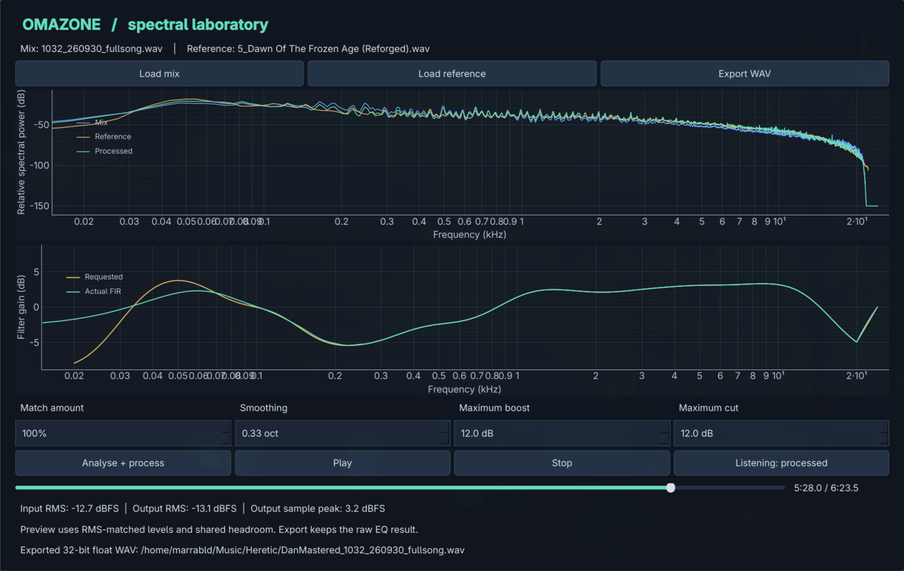

## What works now

- Reference-matching EQ with adjustable amount, octave smoothing, and boost/cut limits.
- Mix, reference, and processed spectrum plots.
- Requested correction versus actual linear-phase FIR response.
- Offline, block-based rendering with compensated filter delay.
- RMS-matched original/processed A/B playback at the same song position.
- Click-and-drag seeking, elapsed/total time, and pause/resume.
- Linked mono/stereo waveform views with peak-preserving zoom and region selection.
- One-shot selection playback and sample-aligned loops with shared original/processed A/B.
- Named targets captured from reference passages, with JSON profile save/load.
- Per-section matching settings and full-song rendering with aligned EQ transitions.
- Selected-region clipping inspection with editable rails, channel diagnostics, and waveform markers.
- Checked-candidate short-gap declipping, original/repaired A/B, reset, and full-precision repair export.
- Mono/stereo WAV, FLAC, and AIFF input; references can have a different sample rate.
- 32-bit floating-point WAV export.
- Versioned saved project recipes, verified source relinking, and retained learned curves.
- Persistent song overview and shared waveform/spectrum viewer across tool pages.

Next priorities are a complete prefix-processing chain,
guided navigation, and manual section EQ. Compression, dynamic EQ, and output
checks follow. See the [approved workflow](docs/workflow.md) and
[roadmap](roadmap.md) for the implementation priorities and contribution tasks.

## Quick start

### Windows without installing Python

Download `Omazone-*-windows-x64.zip` from the
[releases page](https://github.com/marrabld/omazone/releases) (or from a run of
the [Windows build workflow](https://github.com/marrabld/omazone/actions/workflows/release-windows.yml)),
unzip it anywhere, and run `Omazone.exe`. The bundle is built automatically by
GitHub Actions from the tagged source; each release includes a `SHA256SUMS.txt`
checksum file.

The executable is unsigned, so Windows SmartScreen shows a warning
("Windows protected your PC"). Choose "More info" then "Run anyway", and prefer
verifying the SHA-256 checksum over ignoring it. First launch is a little slower
while Windows unpacks the bundle.

### From source

You need Git and [uv](https://docs.astral.sh/uv/getting-started/installation/).
The setup below uses Python 3.13, which uv can download if needed.

```bash
git clone https://github.com/marrabld/omazone.git
cd omazone
uv sync --python 3.13
uv run omazone
```

For an existing checkout:

```bash
uv sync --python 3.13
uv run omazone
```

The desktop app is developed on Linux. Windows users should prefer the packaged
build above; the packaged build is smoke-tested on the CI runner only, so
playback quality still needs real-hardware validation (#14). Qt supplies
cross-platform GUI support, but macOS still needs validation. Playback uses the
default audio output device through PortAudio. If a platform reports a missing
PortAudio library, install it using that system's package manager.

## Save and reopen your work

Use the **Project** menu:

- **Save project** (`Ctrl+S`) writes a versioned `.omazone.json` recipe.
- **Open project** (`Ctrl+O`) restores the recording references, targets, named
  regions, section assignments, accepted repairs, matching settings, stage bypass,
  selection, zoom, position, and loop context.
- **Render saved recipe** replays repairs from the original and uses stored
  matching curves, without silently relearning. Rendered audio is not stored in
  the project file. **Analyse + process** and section analysis explicitly learn
  new matching curves.
- **Stage bypass** skips repair or matching while retaining their choices.
- **Name current selection** adds a stable region independent of matching; the
  **Named regions** submenu returns to it.
- **Relink source/reference** locates a moved original. Sample format and a byte
  fingerprint are checked. Missing/changed recordings leave the recipe intact
  rather than quietly applying it to different audio.

Paths are relative to the project where possible. A cached reference spectrum
can still be used when its reference recording is unavailable. Moving an earlier
processing choice marks later calibration as needing analysis, but stored curves
remain available when their configuration still matches. Updating EQ settings or
assignments requires explicit analysis before those newly requested curves are
available.

This is the project foundation, not the full processor chain. Reserved manual EQ,
dynamics, and output settings are preserved in the schema; enabled unsupported
stages cannot be silently rendered as though implemented. Save explicitly before
closing; loading a new recording/New project starts a new session. Audio originals
are not overwritten by saving projects. Session JSON files are ignored by Git.

## Try it on a song

### Keep the song in view

The workspace stays above the tool controls. Use **Waveform**, **Spectrum**, or
**Both** to inspect the same passage while working in Matching, Regions, Reference
targets, Mix sections, or Clipping inspection. Drag the splitter between the
viewer and controls to give either more space; controls scroll rather than hiding
the song. Matching prioritises its frequency spectrum and filter response, with
compact settings beside the plots on wider windows. Other tools retain the
waveform-led workspace. In Both mode, waveform and spectra are shown side by side.

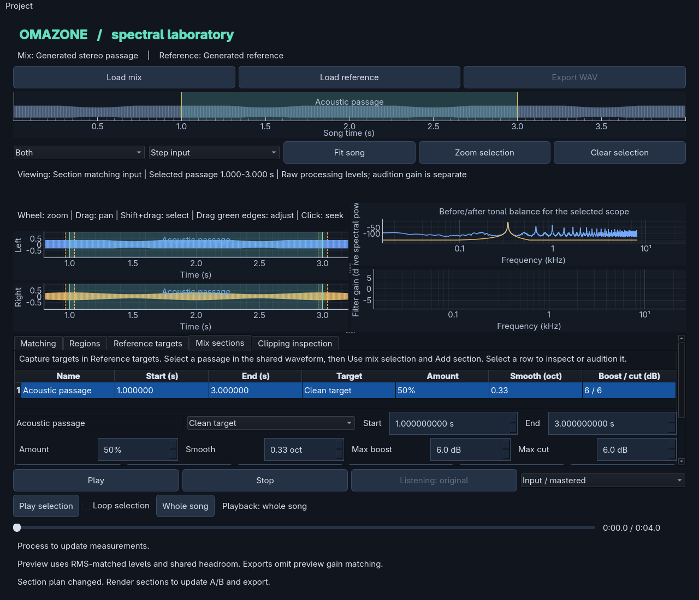

The overview shows the whole song, named passages, your selection, and
playback cursor. Selection, zoom, position, and loop survive tool changes.
On Matching it is hidden by default to give the plots more space; **View → Show
song overview** enables it. Seeking and elapsed/total time remain available.
**Step input**, **Step output**, and **Original recording** identify the visible
signal and coordinate the audition side. Waveforms use raw processing levels;
RMS-matched playback does not change the displayed/exported samples.

If output needs rendering, a yellow message says so and the input remains visible
for context. Spectrum analysis follows the selected passage, runs in a background
worker, and excludes very short selections below 0.1 seconds. Spectrum mode can
keep the time-domain overview. The label identifies input/output and scope;
the spectrum overlays show before/after tonal balance and the reference target.

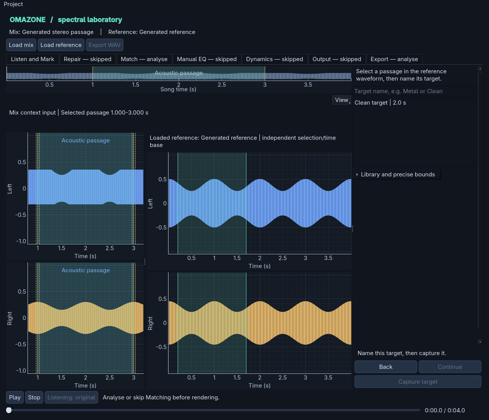

Reference capture retains your mix view and selection. The reference has an
independent waveform/time base. Selecting a library target shows its saved
spectrum; **Show loaded reference for capture** returns to the loaded reference.
Targets without their original audio remain usable. Projects save viewer mode,
signal preference, panel sizes, and the existing selection/zoom/loop context.

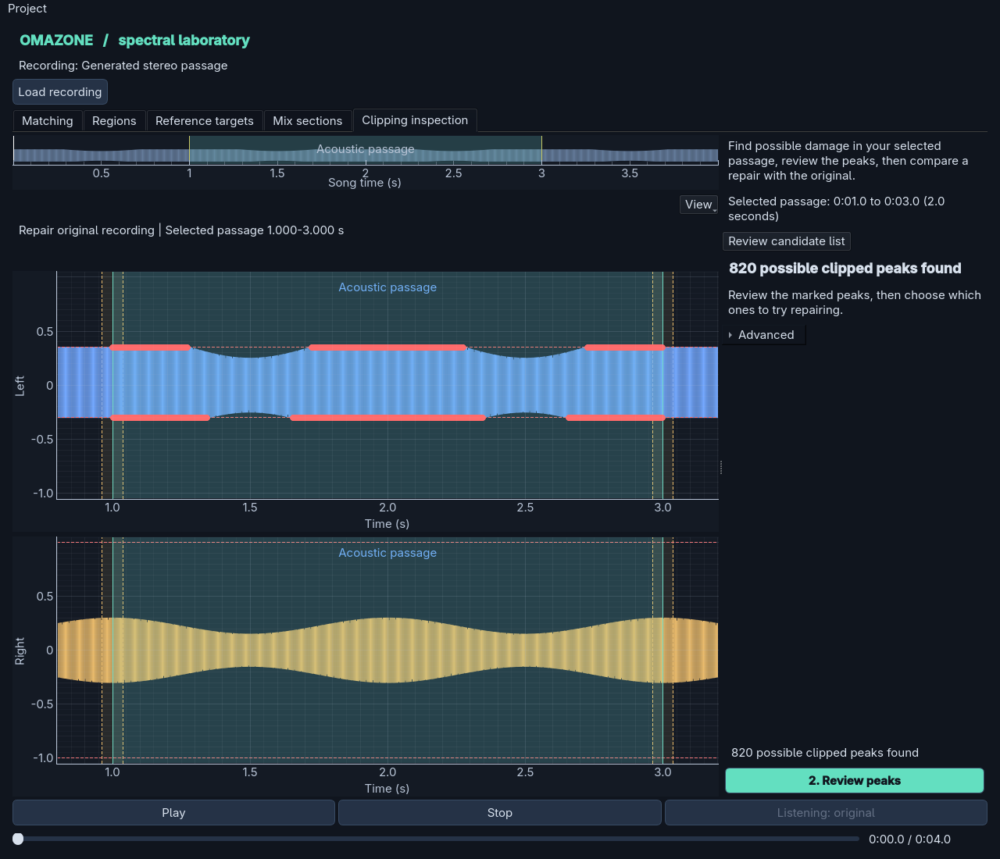

This implements the shared visual context, not the full numbered wizard or all
stage-prefix processing. The current steps are repair and matching; later EQ,
dynamics, and output stages will use the same workspace.

### First matching experiment

Loading a mix or reference leaves you on your chosen tool and keeps the selected
viewer mode. A new session starts on Matching with spectrum/filter plots. Regions,
reference capture, section assignment, and repair start with waveforms. Each tool
remembers an explicitly chosen view. On Matching, its compact **View** menu offers
Waveform/Spectrum/Both, original/input/output signals, and the optional overview.
Looping and returning to whole-recording playback are also available in this menu.
Matching starts with "Load a mix", then "Mix loaded. Add a reference",
then "Mix and reference ready". Reference targets open only when you choose that
tool; loading a reference does not mean you need to capture named targets.

The plots take most of the Matching workspace. **Match amount** is shown in a
compact panel, with smoothing and gain limits under **Advanced matching settings**.
At narrower widths, controls become a strip below the plots. Basic matching
playback is Play/Stop, A/B, seeking, and time; region-loop controls remain on the
waveform-oriented tools. The tabs and primary action bar do not scroll. **Analyse + process** stays visible
on Matching; **Render sections** stays visible on Mix sections. Settings may scroll
when the lower panel is small. **Measurements and status** expands the footer
details when you need them. Opening a saved project still deliberately restores
its saved tool and view preferences.

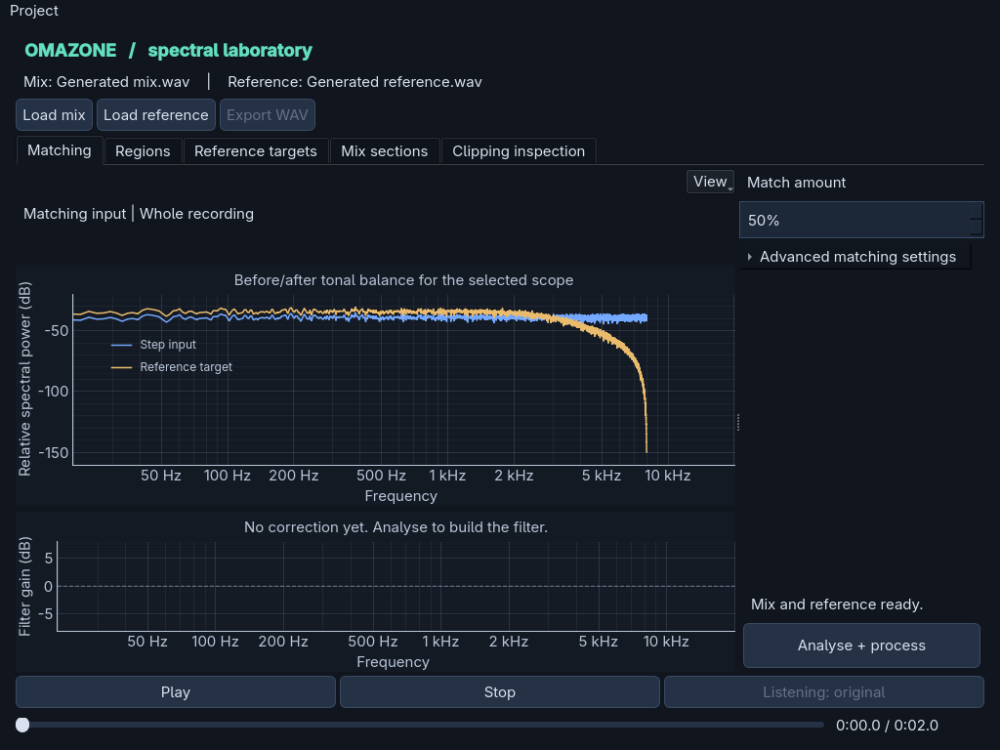

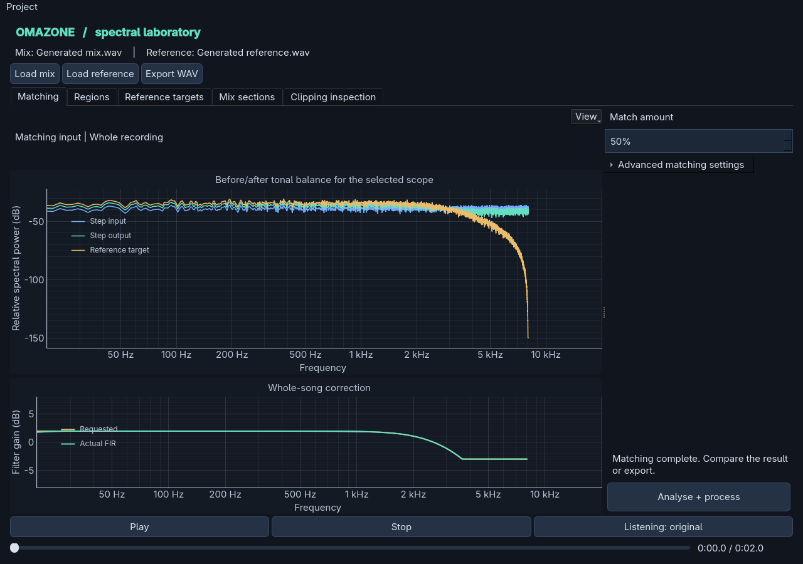

1. Load a mix and a broadly similar reference track.
2. Start with 50% amount, 0.33-octave smoothing, and 6 dB boost/cut limits.
3. Click **Analyse + process** to render the result.
4. Click **Play**, then use the listening button to switch original/processed.
5. Seek to a verse, chorus, or transient-heavy section and compare again.
6. Export when you want to use the processed file elsewhere.

Play auditions the original initially; the listening button switches to the
processed version at the same playback position. Click or drag the seek bar to
audition another section. Playback pauses during a drag and resumes on release
if it was playing. Play/Pause and Stop preserve the cursor; seek to the left edge
to restart. Pressing Play after reaching the end starts from the beginning.
The time display shows elapsed and total time. With the seek bar focused, arrow
keys move one second and Page Up/Down move ten seconds.
Changed settings require another render. WAV, FLAC, and AIFF mono/stereo files
are supported. Different reference and mix sample rates are supported.

## Inspect a waveform and select a region

Choose **Regions** to inspect the shared waveform. It has linked left/right plots,
or one for mono. Loading files keeps the current tool selected.
Choose Spectrum/Both without leaving your tool.
Matching controls are on **Matching**; the response stays in the shared spectrum view.

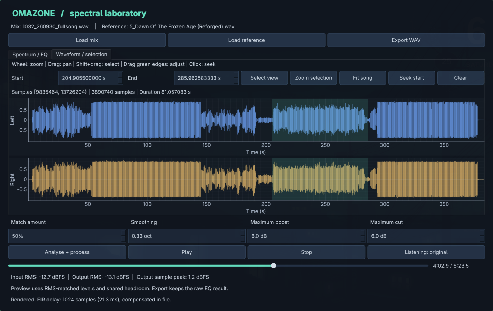

- Use the mouse wheel to zoom horizontally and drag the background to pan.
- **Shift+drag** on the background creates a selection. Drag its green edges to
  resize it, or drag the shaded region to move it. Both channels share the region.
- Edit **Start** and **End** in seconds for precise adjustment. Spin-box steps
  move one sample; the label shows exact sample indices and duration.
- **Select view** selects the visible time range. **Zoom selection** magnifies
  the region; **Fit song** returns to the full track; **Clear** removes it.
- Click the background to seek, or use **Seek start** to audition from the selected
  region's beginning. The white cursor follows the existing playback transport.

Selection bounds are half-open sample intervals `[start, end)`, like a NumPy
slice. Processing and export still use the whole file.
A new mix clears the selection, while changing matching controls or the reference
keeps it.

### Play and loop a selection

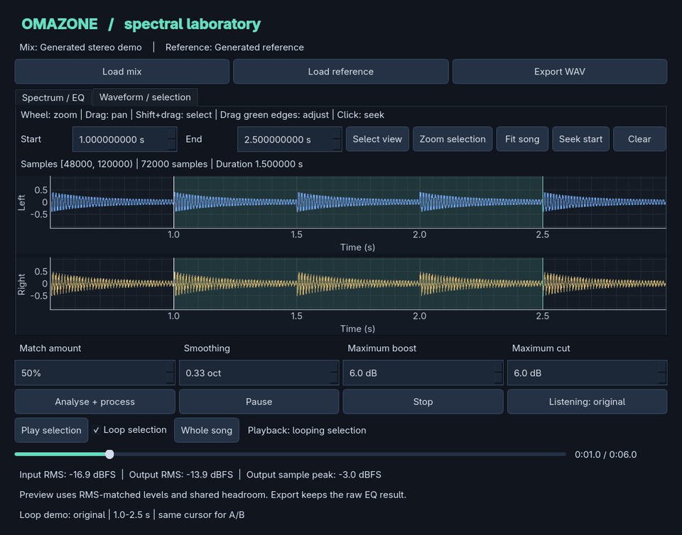

The silent demo uses generated audio and the actual playback callback with a
simulated device. Watch the white cursor wrap at the selection's end and the
listening button switch to processed. [Recreate the demo](docs/loop-demo.md).

Select a passage, then click **Play selection**. Playback starts at its beginning
and stops at its exclusive end. Enable **Loop selection** to repeat it instead.
The loop toggle prepares selected-region playback; if playback is already running,
it continues within the selected bounds. Turning looping off retains one-shot
selection mode, so playback stops at the region end.

- A/B switches keep the same sample position, including across loop boundaries.
- Play/Pause and Stop preserve the cursor and playback mode. Play after the end
  of a one-shot selection restarts at its beginning.
- Seeking inside the active region retains its mode. Seeking outside it returns
  to whole-song mode and turns looping off. **Whole song** also exits region mode.
- Editing an active selection pauses playback, then resumes after the bounds
  settle. Clearing it returns to whole-song mode; Stop cancels a pending resume.
- A new mix resets region playback and looping.

Loop wraps are sample-exact, including regions shorter than an audio callback.
There are no boundary fades yet, so mismatched endpoints can produce clicks;
choose musically sensible boundaries while transition smoothing is developed.

Wide views draw min/max buckets to preserve transients. Zooming in displays raw
samples. An overview bucket may include samples just outside the viewport edge;
zoom to sample level when inspecting an exact boundary. Peak-index construction
runs alongside file analysis in the loading worker, while redraws use a bounded
number of display points.

## Match metal and clean sections separately

Use different targets when a song contains passages with different tonal goals.
Each mix section is analysed independently against its assigned target; the
whole-song spectrum is not used to design its correction.

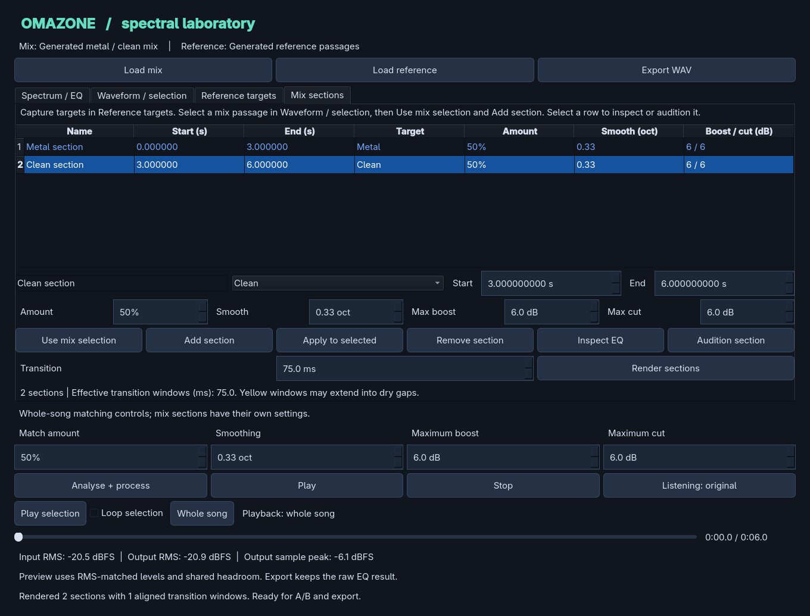

1. Load a reference and open **Reference targets**. Shift+drag its metal passage,
   enter a target name such as `Metal`, and click **Capture target**.
2. Select its clean passage and capture `Clean`. You can also capture targets
   from different reference files; earlier targets remain in the library.
3. Load your mix. In **Regions** or the shared waveform, select the metal passage.
4. Open **Mix sections**, click **Use mix selection**, name the section, choose
   `Metal`, set its amount/smoothing/gain limits, and click **Add section**.
5. Repeat for the clean passage with the `Clean` target. Assignments cannot overlap.
6. Choose a **Transition** duration and click **Render sections**. This produces
   one complete preview and exportable file, keeping the original duration.
7. Select a table row and use **Inspect EQ** to view its requested and actual
   correction. **Audition section** uses the existing transport; enable
   **Loop selection** and switch original/processed to compare it repeatedly.

To change an assignment, select its row, edit the fields, and click **Apply to
selected**. **Inspect EQ** and **Render sections** also apply pending edits to the
selected row. Edits invalidate the old preview and export until you render again.
The controls below the tabs and **Analyse + process** still perform whole-song
matching; section settings live in the section table and editor.

Coloured named regions appear on the mix waveform. Dashed yellow windows show
where neighbouring filtered signals, or a filter and the original audio, blend.
Unassigned samples outside these windows stay unchanged.

The transition setting is the requested full window duration, centred on each
boundary. Windows shorten automatically when neighbouring sections or gaps are
small, so they cannot overlap. The summary lists their effective durations.
At file edges no transition is added. Setting the duration to zero gives a hard
switch; even a nonzero fade can produce an audible tonal change.

Rendering uses surrounding audio context for each linear-phase FIR, compensates
delay before mixing paths, and uses complementary raised-cosine amplitude weights.
Identical paths therefore do not receive an equal-power crossfade gain boost.

**Save targets / Load targets** store versioned JSON spectral profiles and passage
metadata, not the recordings. Imports merge into the library; colliding IDs become
new targets so existing assignments are preserved. References may use a different
sample rate from the mix. Choose at least 0.1 seconds of non-silent material;
longer representative passages generally make better tonal targets.

Section assignments and settings are saved in the project recipe. Loading a new
mix starts a new session but retains the captured target library. Preview level
matching uses whole-file RMS, not separate per-section
loudness normalisation. Section matching controls tonal balance, not dynamics or
vocal/instrument balance.

## Try clipping repair

The clipping screen starts with a guided workflow. Numerical controls are hidden
under **Advanced settings and measurements**, and unrelated mastering controls
are hidden while you inspect or audition a repair.

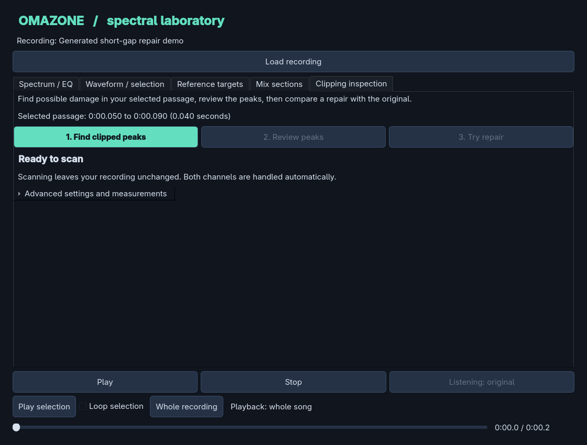

1. Select the affected passage in the shared waveform and open **Clipping inspection**.
2. Click **Find clipped peaks**. Left/right channels are scanned with separate
   suggested levels; scanning does not change your recording.
3. Click **Review peaks**. Inspect a peak if unsure, then check the ones you want
   to try repairing. **Include shown peaks** checks the displayed candidates.
4. Click **Try repair**. Peaks the algorithm cannot reconstruct are kept unchanged.
5. Click **Listen to repair** to loop the selected passage, then use the listening
   button below to switch between original and repaired audio.
6. **Undo repair** restores the original input. **Save repaired audio** exports
   the raw repaired signal without preview gain matching or subsequent EQ.

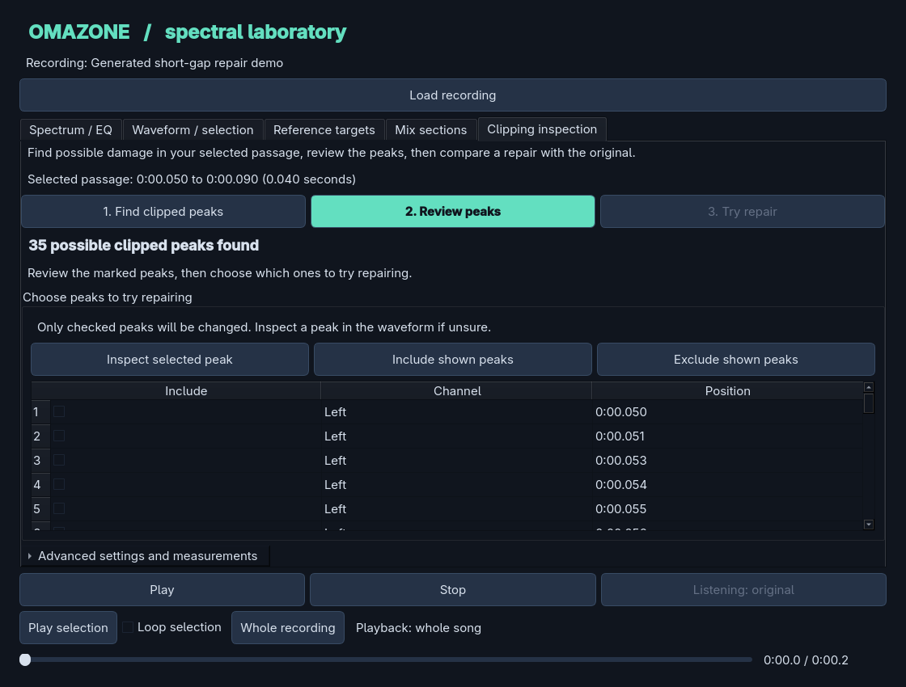

Red waveform markers show possible flattened peaks; orange markers show values
above full scale. Green overlays show reconstructed samples. These generated-audio
screenshots illustrate a clipped left channel and an over-range right channel.

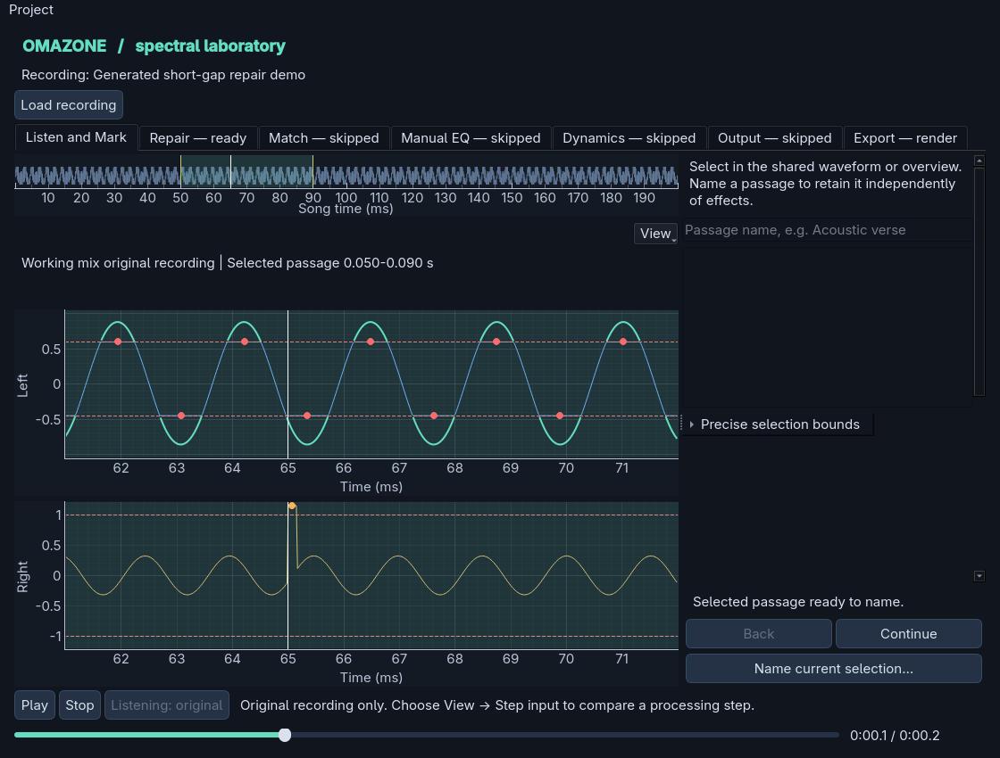

If no clear peaks are found, the screen says so and leaves repair unavailable.
A clipped instrument mixed with other sounds may no longer have visible flat
peaks. Use the isolated recording when available. A float signal above full scale
can instead be a volume-level problem, so those samples are not automatically
treated as missing peaks.

The recording stays unchanged until you explicitly try a repair. Guessed levels
and flat-looking peaks are not proof of damage; clean low-frequency or synthesised
signals can produce false positives. Compare by listening and undo a poor result.

For manual scanning, channel/threshold controls, exact measurements, and repair
parameters, expand **Advanced settings and measurements**. See
[the inspection guide](docs/clipping-inspection.md) and
[the reconstruction algorithm](docs/declipping.md).

### Repair behaviour

The original recording stays in memory unchanged. Whole-song matching and section
matching use the repaired input after a successful repair, and their previous
renders become stale. Mastering audition uses **Input / mastered**; when repair is
active, its input side is the repaired signal. **Original / repaired** remains a
separate comparison. Standard mastering export stays 32-bit float.
Repair saving uses 64-bit float WAV to retain the internal sample precision.

Repair is an offline cubic-Hermite baseline using the intact endpoint samples and
slopes fitted to surrounding audio. Only checked intervals that pass the checks
are changed, without a broad section crossfade. Long runs, insufficient or damaged
context, unsupported slopes, and inconsistent or excessive reconstructions are
skipped. Samples outside successful intervals remain exactly unchanged internally.
Restored peaks may exceed full scale; repair export preserves them rather than
silently limiting or normalising.

Each successful **Try repair** is computed from the original. It updates repairs
inside that selection while retaining repairs elsewhere. A selection that cuts an
existing repaired interval must be expanded to include it. If no interval passes,
the previous repair remains active. The table
shows at most 500 intervals, so **Include shown peaks** covers only displayed candidates.
Use a short representative passage for this first version. Loading a new mix
clears repair state; save the project to retain the operation recipe across restarts.

This does not guarantee recovery. Tests show improvement on deliberately clipped
sine/harmonic examples, but an intentionally flat-topped waveform can be made worse.
Compare by listening, especially on guitar attacks, and use the isolated guitar
recording when available. See [the algorithm and experiment](docs/declipping.md).

## Current limitations

The interface shows RMS and sample peaks, not LUFS or true peaks. Preview is
RMS-matched, with common attenuation to provide headroom. That is an approximate
level comparison, not perceptual loudness matching. Abrupt A/B switches can click;
crossfaded switching is a follow-up improvement.

Mastering exports are 32-bit floating-point WAVs containing the raw EQ result, without
preview attenuation. Samples can exceed 0 dBFS; there is no limiter yet. Delay is
compensated and the output retains the input length. The complete convolution
tail is available through the processor API, but file rendering trims it.

Audio files and outputs are ignored by version control. Dependencies are pinned
in `uv.lock`. Qt uses the `PySide6-Essentials` package: the app only needs
QtCore/QtGui/QtWidgets, and skipping the Addons wheel roughly halves the install
and packaged download. `omazone/__init__.py` restores the package `__version__`
that pyqtgraph expects.

## How it works

1. Welch analysis averages power spectra across time and channels independently.
   It does not sum stereo channels before analysis.
2. Source and reference spectra are interpolated onto a logarithmic frequency grid.
3. Their dB difference is centred to remove an overall level offset. This also
   removes the constant offset from different spectral bin widths.
4. Gaussian smoothing on the log grid reduces narrow, note-specific corrections.
   The smoothing control is the Gaussian standard deviation in octaves.
5. Boost/cut limits are applied, then scaled by the match amount. At 50% amount,
   a 6 dB maximum boost produces at most a 3 dB requested boost.
6. `scipy.signal.firwin2` designs a 2049-tap linear-phase FIR. The actual response
   can differ from the requested curve, especially at low frequencies.
7. A stateful FFT overlap-add processor renders blocks, flushes its tail, and
   the renderer compensates the FIR delay.

Analysis uses the whole file, including quiet passages. Matching an average
spectrum changes tonal balance; it cannot reproduce the reference's arrangement,
vocal balance, dynamics, or loudness. Treat the curve as an experiment rather than
a mastering verdict. Silence is rejected rather than used as a matching target.

## Code map

- `src/omazone/engine.py`: analysis, filter design, processor, offline render.
- `src/omazone/gui.py`: Qt interface, worker thread, preview playback, export.
- `src/omazone/waveform.py`: peak index and GUI-independent sample-region model.
- `src/omazone/waveform_view.py`: linked waveform plots, selection, zoom, and seeking.
- `src/omazone/playback.py`: GUI-independent sample cursor and selected-region buffer filling.
- `src/omazone/sections.py`: named profiles, validation, transition planning, and contextual rendering.
- `src/omazone/section_view.py`: reference capture, profile library, and section-assignment editor.
- `src/omazone/clipping.py`: per-channel plateau candidates, over-range intervals, and threshold hints.
- `src/omazone/clipping_view.py`: diagnostics controls, results table, and interval navigation.
- `src/omazone/declipping.py`: selective Hermite reconstruction, intact-context checks, and rejected intervals.
- `src/omazone/project.py`: versioned recipes, source verification, calibration signatures, and repair replay.
- `src/omazone/project_controller.py`: project menus, save/load/relink, stage bypass, and saved rendering.
- `src/omazone/workspace.py`: persistent viewer/overview, reference companion, signal labels, and background spectra.
- `tests/test_engine.py`: identity, streaming equivalence, spectral improvement,
  stereo preservation, gain limits, and preview headroom.
- `tests/test_gui.py`: render/export workflow, seeking, and shared A/B cursor.
- `tests/test_waveform.py`: preserved peaks, raw-sample zoom, and region bounds.
- `tests/test_playback.py`: exact loop wraps, short regions, one-shot endings, and A/B alignment.
- `tests/test_sections.py`: profile validation, section context, dry gaps, stereo, and transition alignment.
- `tests/test_clipping.py`: asymmetric/scaled clipping, rails, overloads, and documented detection limits.
- `tests/test_declipping.py`: repair accuracy, exact masks, rejection cases, and a known worsening case.
- `roadmap.md`: planned processing modules, priorities, and contribution ideas.

The GUI uses PySide6 and pyqtgraph. The engine uses NumPy and SciPy; SoundFile
handles audio files, and sounddevice handles preview playback. Analysis and
rendering run in a worker thread to keep the interface responsive.

## Contributing

Use feature branches and pull requests for new work. See
[CONTRIBUTING.md](CONTRIBUTING.md) for the branch/review workflow and checks.

Start with the [roadmap](roadmap.md), then browse or open an
[issue](https://github.com/marrabld/omazone/issues). For a new processing module,
describe the intended behaviour and measurements before implementing it. Small,
focused pull requests are easiest to review.

For smaller starting tasks, try [frequency-label cleanup](https://github.com/marrabld/omazone/issues/12),
the [generated-signal tutorial](https://github.com/marrabld/omazone/issues/13), or
[Windows/macOS validation](https://github.com/marrabld/omazone/issues/14).
Comment on the issue you want to pick up so other contributors can coordinate.

Useful contributions include:

- DSP implementations with clear explanations and meaningful verification signals.
- Listening reports that identify the settings and the section being compared.
- GUI improvements, accessibility, and clearer plots.
- Windows/macOS setup and playback reports.
- Documentation and reproducible learning experiments.

To develop, fork the repository, clone your fork, run the quick-start setup, and
create a feature branch. Keep DSP code independent of the GUI and audio devices.
For stateful processing, check behaviour across different block sizes and channel
counts. Use generated signals or small redistributable examples for tests.
Audio files are ignored by default; do not commit recordings or reference tracks
unless you have permission to distribute them.

Before submitting a pull request, run:

```bash
uv run pytest
uv run ruff check .
```

Describe what changed, how you verified it, and any audible or measured tradeoffs.
Screenshots are useful for interface changes. Contributions are accepted under
the project's GPLv3 license.

## Route to real-time

Analysis and coefficient design are separate from sample processing. The FIR
processor exposes `prepare`, `set_filter`, `reset`, `process_block`, `flush`, and
latency in samples. Coefficients are shared across channels. Updating a filter
resets state and is currently an offline operation.

The Python processor allocates and performs FFT work per block. It is a reference
implementation, not a hard-real-time callback. A later native backend can use
preallocated buffers and partitioned convolution while retaining this contract
and testing against these outputs. Filter updates will also need safe handoff
and smoothing. A DAW plugin would require a separate host wrapper and likely a
new GUI; the Qt workbench remains useful for experiments.

The [roadmap](roadmap.md) explains the proposed path from this workbench to a
modular processing chain and, eventually, a real-time backend.

## License

GNU General Public License version 3 only (`GPL-3.0-only`). See [LICENSE](LICENSE)
for the full terms. You may use, modify, and redistribute Omazone under those
terms, including commercially. Distributed derivatives must remain GPL-licensed
and provide corresponding source. There is no warranty.
