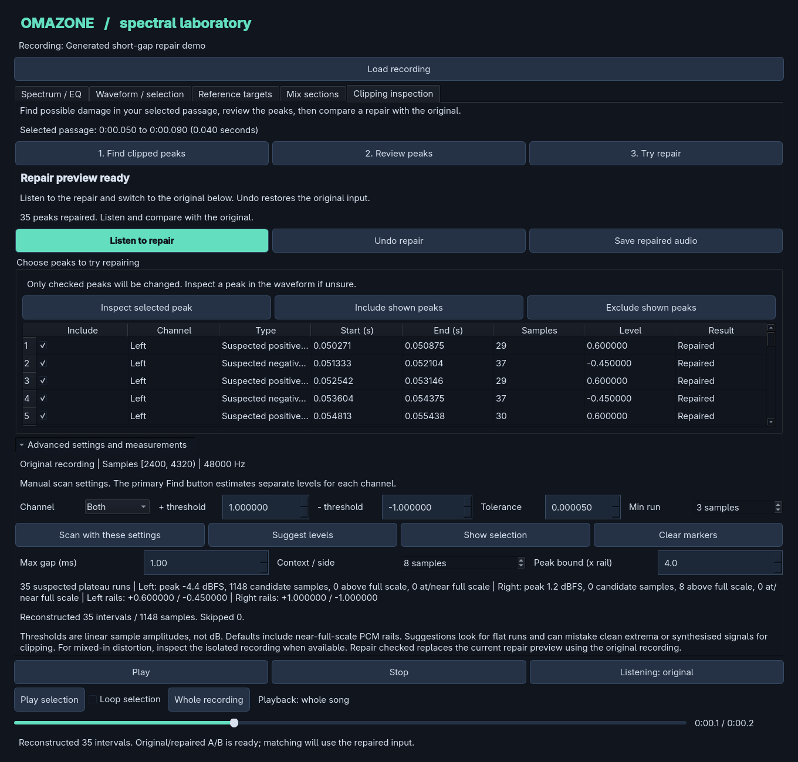

# Clipping inspection: advanced controls

The normal workflow is **Find clipped peaks → Review peaks → Try repair → Listen**.
Start there. The numerical controls below are available under **Advanced settings
and measurements** when a manual experiment is useful.

## Automatic scan

The primary Find button estimates supported positive and negative plateau levels
separately for each channel. Different stereo levels do not require separate UI
passes. If there is no supported hint for a polarity, the nominal +1/-1 rail is
used. Automatic hints are restricted to nominal full scale; over-range values
remain separate diagnostics instead of becoming repair candidates solely by level.

These hints are heuristic. A low-frequency extremum or synthesised flat peak may
look like clipping. Results remain unchecked until you choose candidates to try.
Mixing other sounds with a clipped source can remove visible plateaus entirely.

## Manual scan

- **Channel** chooses mono, both stereo channels, Left, or Right.
- **+ threshold / - threshold** are linear sample amplitudes, not dB. A manual
  scan uses the entered pair for the selected channel(s).
- **Tolerance** controls distance from the rail and maximum variation across a
  plateau. The default 0.00005 includes common near-full-scale PCM rails.
- **Min run** excludes isolated rail hits. Default: three contiguous samples.
- **Suggest levels** provides hints for the manual fields. If channel levels
  disagree, inspect Left/Right separately here, or use the primary automatic scan.
- **Scan with these settings** performs manual analysis. Changing detector fields
  clears stale results; the original and an existing repair remain unchanged.
- **Show selection** fits the selected passage; **Clear markers** clears diagnostics.

The expanded results table shows polarity, start/end seconds, sample counts,
levels, and full rejection reasons. The compact review table instead shows checkboxes,
channels, friendly playback positions, and simple repair results. Double-click
a row or use **Inspect selected peak** to zoom and seek without changing the analysis
selection.

## Reconstruction controls

- **Max gap:** maximum plateau duration, initially 1 ms.
- **Context / side:** contiguous intact samples used to fit endpoint slopes,
  initially eight per side.
- **Peak bound:** a numerical bound expressed as a multiplier of the applicable
  polarity rail, initially 4x. It is not an output limiter.

Review [the algorithm](declipping.md) before interpreting these parameters as
quality controls. Longer gaps or damaged context may be skipped rather than repaired.
Each successful attempt replaces the current repair from the original; attempts
with no successful intervals retain the previous repair preview.

## Markers and measurements

- Red dots: suspected plateau intervals. Dashed red lines: each channel's actual
  scan rails, which may differ after automatic estimation.
- Orange dots: intervals strictly above full scale. Over-range alone is not proof
  that peaks were lost.
- Green curves: successfully reconstructed samples over the original waveform.

Measurements include per-channel sample peak, candidate samples, over-range
samples, and samples within tolerance of nominal full scale. Results use absolute
half-open sample intervals `[start, end)`. Counts include all intervals; the table
shows at most 500. Dense waveform markers are thinned for bounded redraw work.

